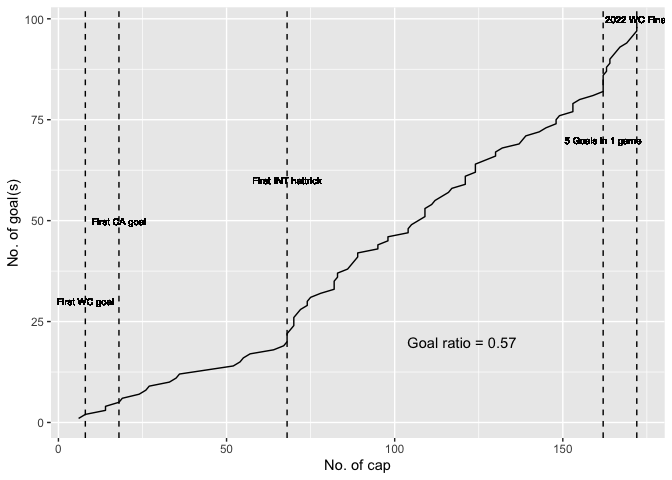
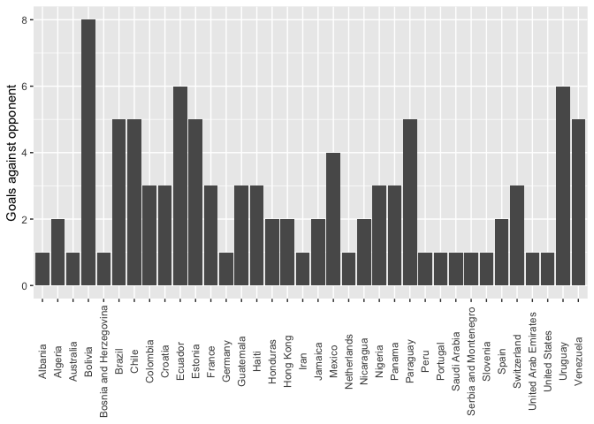
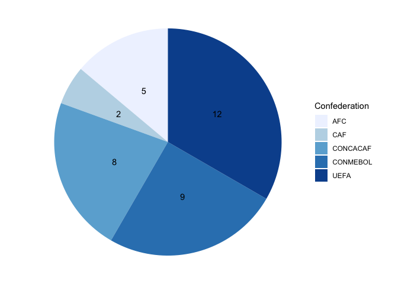

# Greatest of all time

As Leo Messi establishes himself as the greatest fotball player of all
time following the victory at the 2022 World cup, lets take a look at
all of his 98 international goals scored (as of the 20230122).

## Gathering the data

The data of this analysis has been gathered by web-scraping and
importing data. A comprenhensive goal list was web-scraped from
wikipedia, and a dataset of all FIFA nations and its corresponding
confederation was collected from kaggle. The second mentioned dataset
was needed in order to join the web-scraped data for a more
comprehensive list that would include Confederation of each nation.

Data sources:

<https://en.wikipedia.org/wiki/List_of_international_goals_scored_by_Lionel_Messi>
<https://www.kaggle.com/datasets/cashncarry/fifaworldranking?resource=download>

## Visualizing the data

Lets take a deeper look of the gathered data.

### Linechart of career goals

 As of
230122, Messi has socred 98 goals on 172 games, resulting in a goal
ratio of 0,57.

The lineplot showcases some of his memorable goals such as first goal at
a world cup and copa américa.

 

### Barchart of goals against each opponent

 The
barchart shows the number of goals Messi has against each nation he has
scored against, Bolivia sticks out with 8 goals. Uruguay and Ecuador
comes in second with 6 goals.

### Piechart of \# of nations scored against in each confederation

Despite playing in the CONMEBOL confederaion, Messi has scored against
more nations from the UEFA confederation, a total 12 unique nations.
While only scored against 2 nations from CAF.

A deeper look into the piechart gives us this dataframe:

    ##    Confederation                 nation
    ## 1            AFC              Hong Kong
    ## 2            AFC              Australia
    ## 3            AFC                   Iran
    ## 4            AFC           Saudi Arabia
    ## 5            AFC   United Arab Emirates
    ## 6            CAF                Nigeria
    ## 7            CAF                Algeria
    ## 8       CONCACAF                 Mexico
    ## 9       CONCACAF              Guatemala
    ## 10      CONCACAF                  Haiti
    ## 11      CONCACAF                 Panama
    ## 12      CONCACAF               Honduras
    ## 13      CONCACAF                Jamaica
    ## 14      CONCACAF              Nicaragua
    ## 15      CONCACAF          United States
    ## 16      CONMEBOL                Bolivia
    ## 17      CONMEBOL                Ecuador
    ## 18      CONMEBOL                Uruguay
    ## 19      CONMEBOL                 Brazil
    ## 20      CONMEBOL                  Chile
    ## 21      CONMEBOL               Paraguay
    ## 22      CONMEBOL              Venezuela
    ## 23      CONMEBOL               Colombia
    ## 24      CONMEBOL                   Peru
    ## 25          UEFA                Estonia
    ## 26          UEFA                Croatia
    ## 27          UEFA                 France
    ## 28          UEFA            Switzerland
    ## 29          UEFA                  Spain
    ## 30          UEFA                Albania
    ## 31          UEFA Bosnia and Herzegovina
    ## 32          UEFA                Germany
    ## 33          UEFA            Netherlands
    ## 34          UEFA               Portugal
    ## 35          UEFA  Serbia and Montenegro
    ## 36          UEFA               Slovenia

### Goal in each competition

Let’s take a look of the competition the goals were scored in.

    ##                          Competition goals_in_comp
    ## 1                           Friendly            43
    ## 2  2014 FIFA World Cup qualification            10
    ## 3  2018 FIFA World Cup qualification             7
    ## 4  2022 FIFA World Cup qualification             7
    ## 5                2022 FIFA World Cup             5
    ## 6            Copa América Centenario             5
    ## 7  2010 FIFA World Cup qualification             4
    ## 8                2014 FIFA World Cup             4
    ## 9                  2021 Copa América             4
    ## 10                 2007 Copa América             2
    ## 11         2022 FIFA World Cup Final             2
    ## 12               2006 FIFA World Cup             1
    ## 13                 2015 Copa América             1
    ## 14               2018 FIFA World Cup             1
    ## 15                 2019 Copa América             1
    ## 16 2019 Superclásico de las Américas             1

43 of Messi’s 98 Goals has come from international friendly games.
Something worth noting is how Messi has scored in every world cup he has
participated in, except 2010 (!). 2022 World cup final was also the
first time ever Messi has scored in a international tournament final,
despite having played a hand full of finals.
